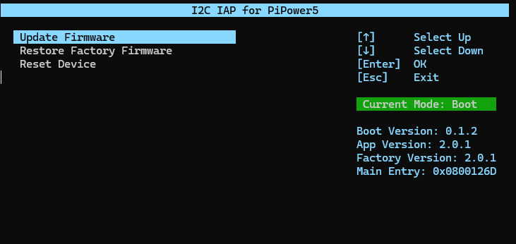

# pipower5_update_tools
I2C IAP tools for PiPower5

<p>
  
</p>

## Install depencies

```
git clone https://github.com/zhuyaliang/pipower5_update.git --depth 1

sudo pip3 install blessed --break
sudo pip3 install smbus2 --break

```

## Usage

1. Stop PiPower5 Service (If you have runned pipower5 service)
```
sudo systemctl stop pipower5.service
```
2. get update file
```
cd pipower5_update_tools
git pull
```
3. run
```
python3 run.py
```

